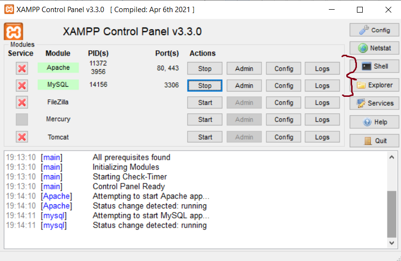

<h2>Shop PHP</h2>

### Установка 

1. Создайте папку "uploaded_img"
2. Скачать xampp
3. Откройте xampp-control.exe от имени администратора
4. Запустите 2 локальных сервера. Подробнее на скриншоте: 

5. Импортируйте базу данных (файл shop_db.sql) в localhost/phpmyadmin
6. Сделайте клон проекта в директорию, где лежит xampp(в htdocs)
7. Зайдите по ссылке localhost/{название проекта(папки)} (если так называется ваш проект)
8. Нажимайте на файл с регистрацией или же на авторизацию(если есть аккаунт)

### База данных

### Технологии

- html
- css
- javascript
- php
- mysql 
- xampp

### Функции сайта

- Админ панель:
    - добавление товаров
    - удаление товаров
    - просмотр пользователей, заказов, сообщений
    - удаление пользователей
    - менять статус заказов, а также их удалять
- Юзер панель:
    - добавление товаров в избранное
    - добавление товаров в корзину
    - просмотр товаров
    - удаление товаров
    - заполнение информации при заказе
    - страница checkout при оформлении заказа
    - просмотр заказа для того, чтобы знать какой статус
    - контакт с администрацией
    - просмотр карточки товаров через view_page

- Для всех: 
    - регистрация
    - авторизация

### Админ-панель

почта: admin@mail.ru

пароль: admin11

### Демонстрация

#### Админ-панель

<video src="img/admin.mp4"></video>

#### Юзер-панель

<video src="img/user.mp4"></video>